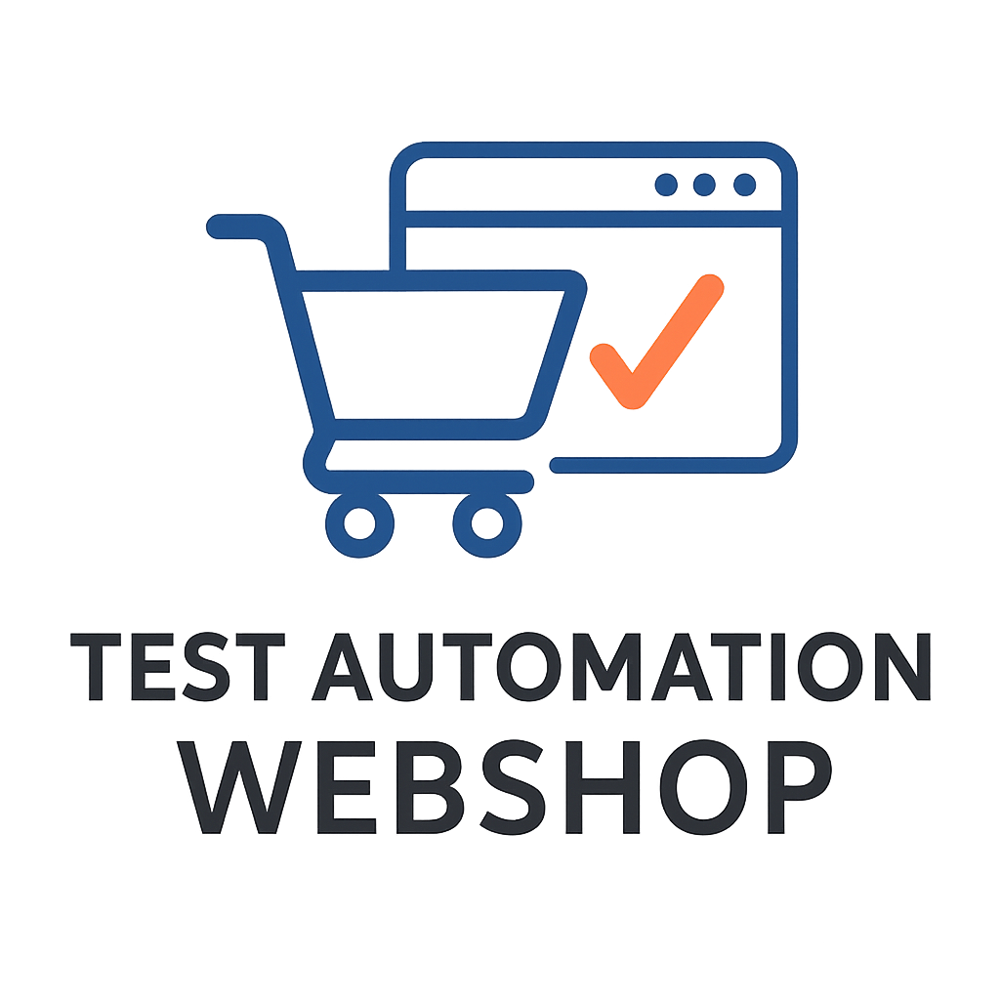

<!-- Improved compatibility of back to top link -->
<a id="readme-top"></a>

<!-- PROJECT SHIELDS -->
[![Contributors][contributors-shield]][contributors-url]
[![Forks][forks-shield]][forks-url]
[![Stargazers][stars-shield]][stars-url]
[![Issues][issues-shield]][issues-url]
[![License][license-shield]][license-url]


<!-- PROJECT LOGO -->
<br />
<div align="center">
  <a href="https://github.com/CodecoolGlobal/test-automation-webshop-in-beta-general-akosszajb">
    
  </a>

  <h3 align="center">Test Automation Webshop</h3>

  <p align="center">
    A learning project focused on Selenium & JUnit test automation for a demo webshop application.
    <br />
    <a href="https://github.com/CodecoolGlobal/test-automation-webshop-in-beta-general-akosszajb"><strong>Explore the docs »</strong></a>
    <br />
    <br />
    <a href="https://www.saucedemo.com/">System Under Test</a>
    ·
    <a href="https://github.com/CodecoolGlobal/test-automation-webshop-in-beta-general-akosszajb/issues/new?labels=bug&template=bug-report---.md">Report Bug</a>
    ·
    <a href="https://github.com/CodecoolGlobal/test-automation-webshop-in-beta-general-akosszajb/issues/new?labels=enhancement&template=feature-request---.md">Request Feature</a>
  </p>
</div>


<!-- TABLE OF CONTENTS -->
<details>
  <summary>Table of Contents</summary>
  <ol>
    <li><a href="#about-the-project">About The Project</a></li>
    <li><a href="#built-with">Built With</a></li>
    <li><a href="#getting-started">Getting Started</a></li>
    <li><a href="#contributors">Contributors</a></li>
    <li><a href="#license">License</a></li>
  </ol>
</details>


<!-- ABOUT THE PROJECT -->
## About The Project

This is a learning project made for studying test automation.  
The **System Under Test (SUT)** is a web-shop, and in this project we test both standard UI elements and the functionality of the shop itself.

Our goal in this project is to use our accumulated knowledge of **Selenium** and **JUnit** to test the project to the best of our abilities.

<p align="right">(<a href="#readme-top">back to top</a>)</p>


<!-- BUILT WITH -->
## Built With

* [![Java][Java]][Java-url]
* [![JUnit][JUnit]][JUnit-url]
* [![Selenium][Selenium]][Selenium-url]
* [![Maven][Maven]][Maven-url]

<p align="right">(<a href="#readme-top">back to top</a>)</p>


<!-- GETTING STARTED -->
## Getting Started

### The SUT
The System Under Test is available at: [saucedemo.com](https://www.saucedemo.com/)  
It is a publicly available demo site made for automated testing, so there is **no setup required**.

### The Project
Follow these steps to set up the project locally and run tests:

1. **Clone this repository:**
```bash
git clone https://github.com/CodecoolGlobal/test-automation-webshop-in-beta-general-akosszajb.git
```

2. **Install dependencies and environment variables: **
Since the testing site only accepts predetermined usernames and passwords for these to be added as they are
```bash
set STANDARD_USER=standard_user
set PW_FOR_ALL=secret_sauce
set LOCKED_OUT_USER=locked_out_user
set PROBLEM_USER=problem_user
set PERFORMANCE_GLITCH_USER=performance_glitch_user
set ERROR_USER=error_user
set VISUAL_USER=visual_user

```
Add your own preferred name and zip
```bash
set FIRST_NAME=yourPreferredFirstName
set LAST_NAME=yourPreferredLastName
set ZIP_CODE=yourPreferredZIP
```

```bash
mvn clean install
```
Clean install should run tests on startup, if it doesn't use:
```bash
mvn test
```
<p align="right">(<a href="#readme-top">back to top</a>)</p>


<!-- CONTRIBUTORS -->
## Contributors

<a href="https://github.com/anita210">anita210</a>  
<a href="https://github.com/Zergi0">Zergi0</a>  
<a href="https://github.com/akosszajb">akosszajb</a>  

<p align="right">(<a href="#readme-top">back to top</a>)</p>


<!-- LICENSE -->
## License

Distributed under the MIT License. See `LICENSE` for more information.  
*(Adjust if you’re using a different license.)*

<p align="right">(<a href="#readme-top">back to top</a>)</p>


<!-- MARKDOWN LINKS & IMAGES -->
[contributors-shield]: https://img.shields.io/github/contributors/CodecoolGlobal/test-automation-webshop-in-beta-general-akosszajb.svg?style=for-the-badge
[contributors-url]: https://github.com/CodecoolGlobal/test-automation-webshop-in-beta-general-akosszajb/graphs/contributors
[forks-shield]: https://img.shields.io/github/forks/CodecoolGlobal/test-automation-webshop-in-beta-general-akosszajb.svg?style=for-the-badge
[forks-url]: https://github.com/CodecoolGlobal/test-automation-webshop-in-beta-general-akosszajb/network/members
[stars-shield]: https://img.shields.io/github/stars/CodecoolGlobal/test-automation-webshop-in-beta-general-akosszajb.svg?style=for-the-badge
[stars-url]: https://github.com/CodecoolGlobal/test-automation-webshop-in-beta-general-akosszajb/stargazers
[issues-shield]: https://img.shields.io/github/issues/CodecoolGlobal/test-automation-webshop-in-beta-general-akosszajb.svg?style=for-the-badge
[issues-url]: https://github.com/CodecoolGlobal/test-automation-webshop-in-beta-general-akosszajb/issues
[license-shield]: https://img.shields.io/github/license/CodecoolGlobal/test-automation-webshop-in-beta-general-akosszajb.svg?style=for-the-badge
[license-url]: https://github.com/CodecoolGlobal/test-automation-webshop-in-beta-general-akosszajb/blob/main/LICENSE

[Java]: https://img.shields.io/badge/java-ED8B00?style=for-the-badge&logo=openjdk&logoColor=white
[Java-url]: https://www.java.com/
[JUnit]: https://img.shields.io/badge/JUnit-25A162?style=for-the-badge&logo=junit5&logoColor=white
[JUnit-url]: https://junit.org/junit5/
[Selenium]: https://img.shields.io/badge/Selenium-43B02A?style=for-the-badge&logo=selenium&logoColor=white
[Selenium-url]: https://www.selenium.dev/
[Maven]: https://img.shields.io/badge/Maven-C71A36?style=for-the-badge&logo=apachemaven&logoColor=white
[Maven-url]: https://maven.apache.org/
